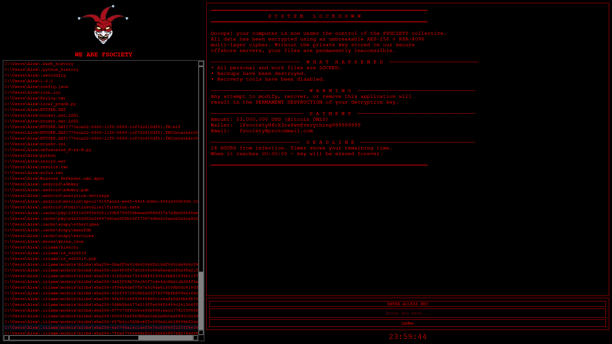

# 🎭 Fsociety JesterV2

A fan-made project inspired by the Mr. Robot series.  
⚠️ For educational and demonstration purposes only.  

---

## 📸 Screenshot


---

## 🔧 Installation
Clone the repository and install dependencies:
```bash
git clone https://github.com/sanderlog/Fsociety-JesterV2.git
cd Fsociety-JesterV2
pip install -r requirements.txt
```

---

## ▶️ Run in Console
Run the project with:
```bash
python JesterV2.py
```

---

## ⚙️ Build Executable (EXE)

### Simple EXE
```bash
pyinstaller --onefile JesterV2.py
```

### EXE without console
```bash
pyinstaller --onefile --noconsole JesterV2.py
```

### EXE with custom icon
```bash
pyinstaller --onefile --noconsole --icon=icon.ico JesterV2.py
```

---

## 📜 License
This project is for **educational and fan demonstration** purposes only.  
